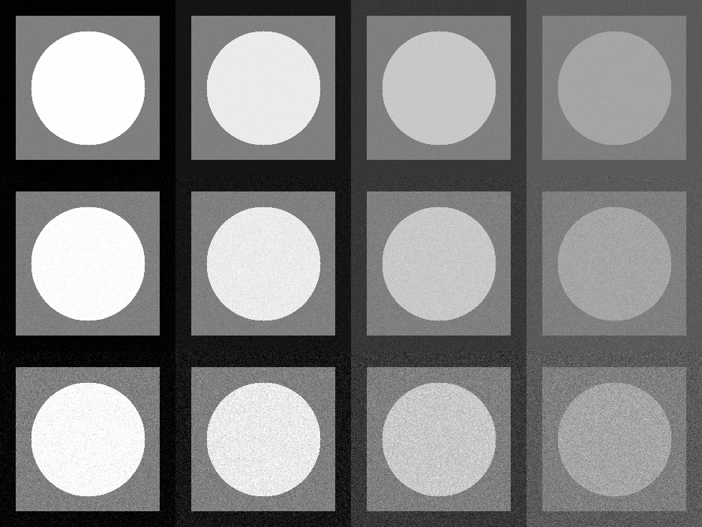
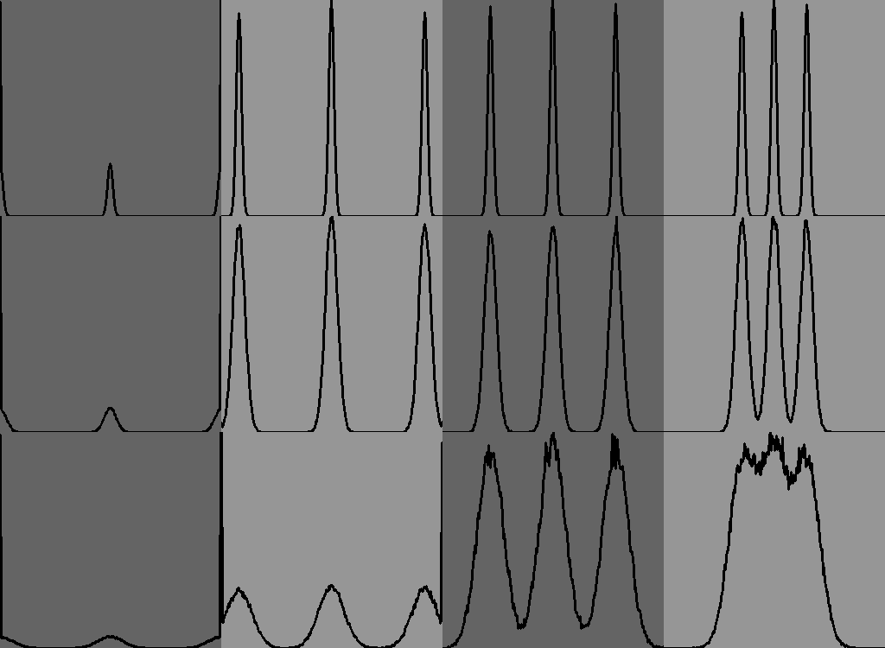

# заголовок

## Часть1 : генерация серых изображений с гауссовым шумом

Была реализована функция генерации изображений

Для следующих наборов яркостей ([0,127,255], [20,127,235], [55,127,200], [90,127,165]) мы получаем следующий результат

После применения к каждому изображению шума Гаусса с сигмой 3,7,15 получаем следующий результат  

## Часть2 : анализ числовых статистик и рисование гистограмм

Далее представлена таблица рассчитанных статистик по полученному коллажую. Масками выделялись отдельно области с монотонной интенсивностью для разных значений сигмы шума.

| std_exp | mean_exp | std_cur | mean_cur |
| --- | --- | --- | --- |
| 3 | 0 | 1.77741 | 1.19192 |
| 3 | 127 | 2.97971 | 126.998 |
| 3 | 255 | 1.75009 | 253.812 |
| 3 | 20 | 3.00739 | 20.0044 |
| 3 | 127 | 3.01808 | 127.001 |
| 3 | 235 | 3.02514 | 234.994 |
| 3 | 55 | 3.00711 | 55.0097 |
| 3 | 127 | 3.03129 | 127.009 |
| 3 | 200 | 2.99006 | 200.004 |
| 3 | 90 | 3.00976 | 89.9814 |
| 3 | 127 | 3.0197 | 127.016 |
| 3 | 165 | 2.98233 | 164.994 |
| 7 | 0 | 4.11326 | 2.79856 |
| 7 | 127 | 6.9693 | 126.997 |
| 7 | 255 | 4.16886 | 252.14 |
| 7 | 20 | 7.0151 | 20.0158 |
| 7 | 127 | 7.02826 | 127.045 |
| 7 | 235 | 6.98141 | 235.068 |
| 7 | 55 | 6.96864 | 54.9675 |
| 7 | 127 | 7.00408 | 127.01 |
| 7 | 200 | 7.06044 | 199.972 |
| 7 | 90 | 6.99849 | 89.9625 |
| 7 | 127 | 7.02319 | 127.05 |
| 7 | 165 | 7.07348 | 164.935 |
| 15 | 0 | 8.79415 | 6.03811 |
| 15 | 127 | 14.9507 | 127.049 |
| 15 | 255 | 8.69952 | 249.064 |
| 15 | 20 | 13.9188 | 20.6755 |
| 15 | 127 | 14.9663 | 127.103 |
| 15 | 235 | 13.7225 | 234.275 |
| 15 | 55 | 14.9801 | 55.0309 |
| 15 | 127 | 14.97 | 126.849 |
| 15 | 200 | 14.9394 | 200.025 |
| 15 | 90 | 14.9377 | 90.0947 |
| 15 | 127 | 15.0497 | 126.9 |
| 15 | 165 | 15.0568 | 165.019 |

Заметно, что mean фактическое совпадает с интенсивностью яркости пикселей в области. А значения std практически совпадают с оными при применении шума.

Далее была отрисована гистограмма распределения яркостей по изображениям в соответствии с их расположениям на коллаже

